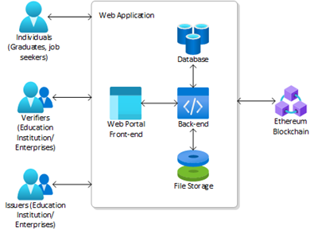
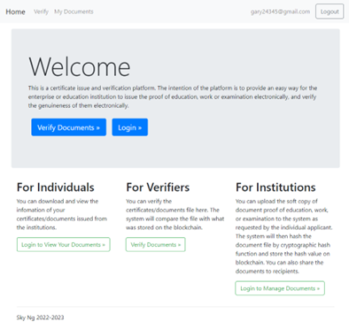
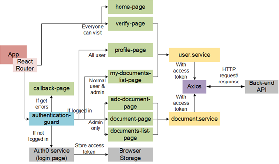
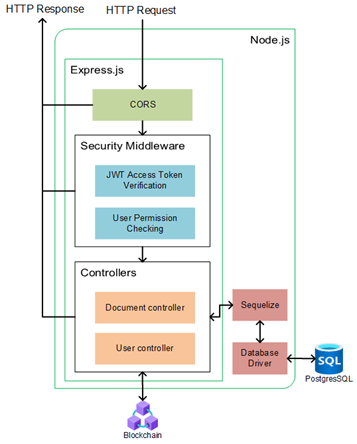
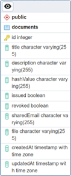

# Blockchain-based E-certificate System
> My Final Year Project in 2023

The objective of this project is to build a web application on blockchain as a certificate issue and verification platform for job application. The intention of the application is to provide an easy way for the enterprise or education institution to issue the proof of education, work or examination electronically, and verify the genuineness of them electronically.

Also, the application can provide a way to allow individual users, who are the job seekers, to receive the electronic certificate which can be verified by the recruiter. Therefore, the institution can save the time on issuing and verifying the traditional paper documents, while the job seeker can save the time of getting paper copy of the document and having a shorter wait of reference checking.

## Overview of the Application
A web application with a hybrid approach of traditional stack and blockchain technology is built in this project.

The project is a web application that allows institution to upload and manage their documents. The application uses blockchain technology to ensure the authenticity and integrity of the documents. The application also allows institution to share their documents with the individuals and allows the verifiers to verify the documents.

## Front-end
The front-end side is a React.js client with React Router, Axios, Bootstrap and integrated with Auth0 authentication service

The following is the brief explanation of the important components:
- App - The main component of the React application, which is responsible for rendering different pages based on the URL path. It also handles user authentication using the Auth0 library and displays a navigation bar with links to different pages based on the user's authentication status and role. The component also includes several sub-components for displaying different pages, as well as helper functions for handling user login, logout, and sign up.

- Authentication Guard - It uses the function from the Auth0’s library to wrap the provided component (protected page like Profile Page, Document Page etc.), ensuring that it can only be accessed by authenticated users. If the user is not authenticated, the user will be redirected to Auth0’s authentication page.

- Callback Page - It uses the hook from the Auth0’s library. If there is an error during authentication, it displays an error message.

- Profile Page - It is responsible for displaying the user's profile information, including their username, email, email verification status and user role etc.

- Add Document Page, Document Page, Documents List Page, and My Documents List Page are responsible for the CRUD operations of the document, while non admin user only can access My Documents Page. Document Service is used to access the protected back-end API for the administrator, while User Service is for the normal user. Access token obtained from Auth0 is included in the HTTP header if a protected API is called.

- Verify Page – It is responsible for the document verification and open to public. User Service is used to access the back-end API.

## Back-end
The back-end side is a REST API using Node.js Express with Auth0 for user authentication and Sequelize for interacting with PostgresSQL database.

The following diagram shows the overview of the back-end implementation. The HTTP request which matches an API route will first go to the CORS middleware which enable CORS (Cross-origin resource sharing) for Express. Then, the request will be processed by the security middleware to verify the access token, and check whether the user has administrator permission. If the request is authorized, it will be handled by the controllers.

- Document controller is responsible for handling the CRUD operations of the document. It uses Sequelize ORM to interact with a PostgreSQL database and Web3.js library to interact with a smart contract on the blockchain. The functions include updating a document, creating a new document, checking if a document title or hash already exists, retrieving all documents or a single document, deleting a document, and transferring a document file.

- User controller is responsible for checking a given hash value exists in the database and on the blockchain by interact with database and smart contract, and then return the result. It also responsible for retrieving documents and transferring files which belongs to the user.

There are two major use cases for which different endpoints have been created (see Table 1 and 2 below).

#### Table 1. API Endpoints for Public and Register User

|     HTTP Method    |     Route                          |     Description                                                                                                                                                                                         |   |   |
|--------------------|------------------------------------|---------------------------------------------------------------------------------------------------------------------------------------------------------------------------------------------------------|---|---|
|     POST           |     /api/usr/verifyhash            |     Check if a user's password hash already   exists in the database. This endpoint is open to public.                                                                                                  |   |   |
|     POST           |     /api/usr                       |     Retrieve all user data from the   database. It requires an access token to be validated before allowing access   to the data.                                                                       |   |   |
|     GET            |     /api/usr/download/:fileName    |     Download a file associated with a user.   It also requires an access token to be validated and checks if the user has   permission to download the file before allowing the download to proceed.    |   |   |

#### Table 2. API Endpoints for Institution Administrator

|     HTTP Method    |     Route                          |     Description                                                                                                                                                      |   |   |
|--------------------|------------------------------------|----------------------------------------------------------------------------------------------------------------------------------------------------------------------|---|---|
|     POST           |     /api/doc                       |     Create a new document after validating   the access token and checking the required permissions. It also uses the   multer middleware to handle file uploads.    |   |   |
|     POST           |     /api/doc/title                 |     Check if a document title already exists   after validating the access token and checking the required permissions.                                              |   |   |
|     GET            |     /api/doc                       |     Retrieve all documents after validating   the access token and checking the required permissions.                                                                |   |   |
|     GET            |     /api/doc/:id                   |     Retrieve a specific document by ID after   validating the access token and checking the required permissions.                                                    |   |   |
|     PUT            |     /api/doc/:id                   |     Update a specific document by ID after   validating the access token and checking the required permissions.                                                      |   |   |
|     DELETE         |     /api/doc/:fileName             |     Delete a specific document by file name   after validating the access token and checking the required permissions.                                               |   |   |
|     GET            |     /api/doc/download/:fileName    |     Handle downloading a specific document   by file name after validating the access token and checking the required permissions.                                   |   |   |

### Authentication of the System
Auth0 services are used for the authentication of the application. Auth0 is a cloud-based platform that provides identity management and authentication services for applications, websites, and APIs. The more important thing is that Auth0 provides email verification, which save a lot of time and resources to develop an email verification mechanism from scratch for this application. It is important to verify the user has access to that email to prevent an imposter registering an account in this application.

In this project, an online tutorial with code sample from Auth0 were used as a reference to integrate the current stack with Auth0 service.

### Database
PostgreSQL database is used for the backend system. Since the users and roles are managed by Auth0, the database only responsible for storing documents data. A “documents” table has been created on the database to store the title, description, hash value, issuance and revocation status, recipient’s email, and document file name. The database also helps to reduce the number of interactions with the smart contract by storing the status of issuance and revocation. Thus, the application can have a faster response when users visit the document list page.

## Blockchain
### Smart Contract
A smart contract called "CertificateRegistry" is developed and located in `backend/contracts`. It allows institution to issue certificates and store their hash values on the blockchain. The certificates are stored in a mapping called "certificates" which maps a unique hash of the certificate data to a struct containing the details of the certificate, including the address of the issuer, the hash of the certificate data, and whether the certificate has been revoked or not.

The contract provides functions to issue a certificate, retrieve the details of a certificate, revoke a certificate, and check if a certificate has been revoked. When a certificate is revoked, an event is emitted to notify listeners that the certificate has been revoked.

### Truffle and Ganache
Truffle and Ganache are two popular development tools used in blockchain and smart contract development, which is used in this project.

Truffle is a development framework that simplifies the process of building, testing, and deploying smart contracts on the Ethereum network. Ganache is a personal Ethereum blockchain for Ethereum development. It allows developers to test and debug their contracts in a local environment without the need for an actual Ethereum network.

## Project Setup
Please refer to the coresponding README in the backend and frontend folder.

## References

- "What is truffle?," Truffle. [Online]. Available: https://trufflesuite.com/docs/truffle/.

- "What is ganache?," Ganache. [Online]. Available: https://trufflesuite.com/docs/ganache/.

- "React with react router 6 (javascript) + express.js (JavaScript) code sample: Basic role-based access control (RBAC) for Hello World Full-stack app," Auth0 Developer Resources. [Online]. Available: https://developer.auth0.com/resources/code-samples/full-stack/hello-world/basic-role-based-access-control/spa/react-javascript/express-javascript#set-up-and-run-the-express-js-project.

- "React JWT Authentication (without Redux) example" Bezkoder. [Online]. Available: https://www.bezkoder.com/react-jwt-auth/

- "Node.js JWT Authentication with PostgreSQL example" Bezkoder. [Online]. Available: https://www.bezkoder.com/node-js-jwt-authentication-postgresql/

